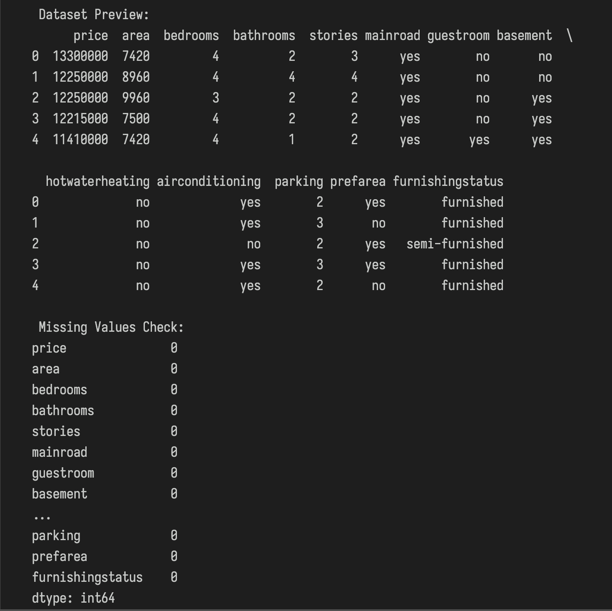
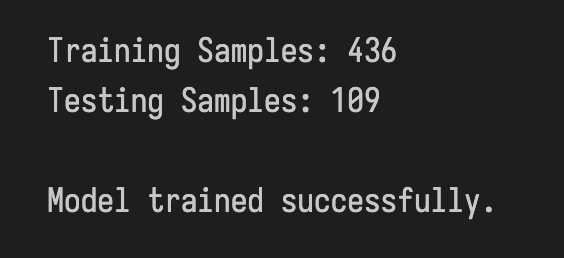
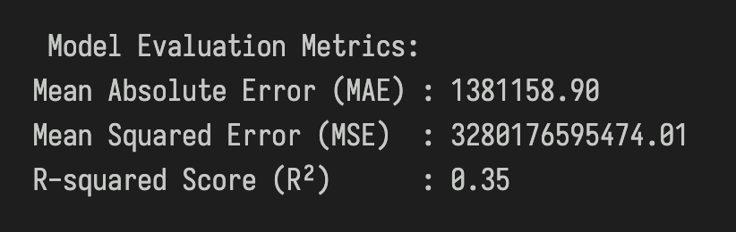
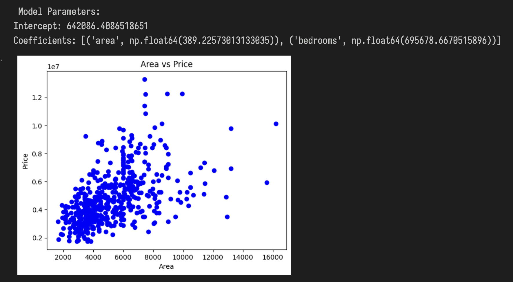
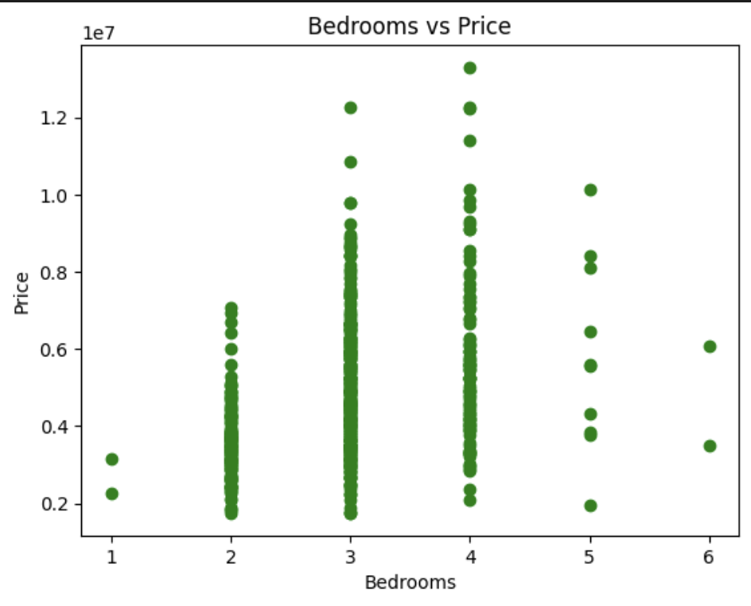
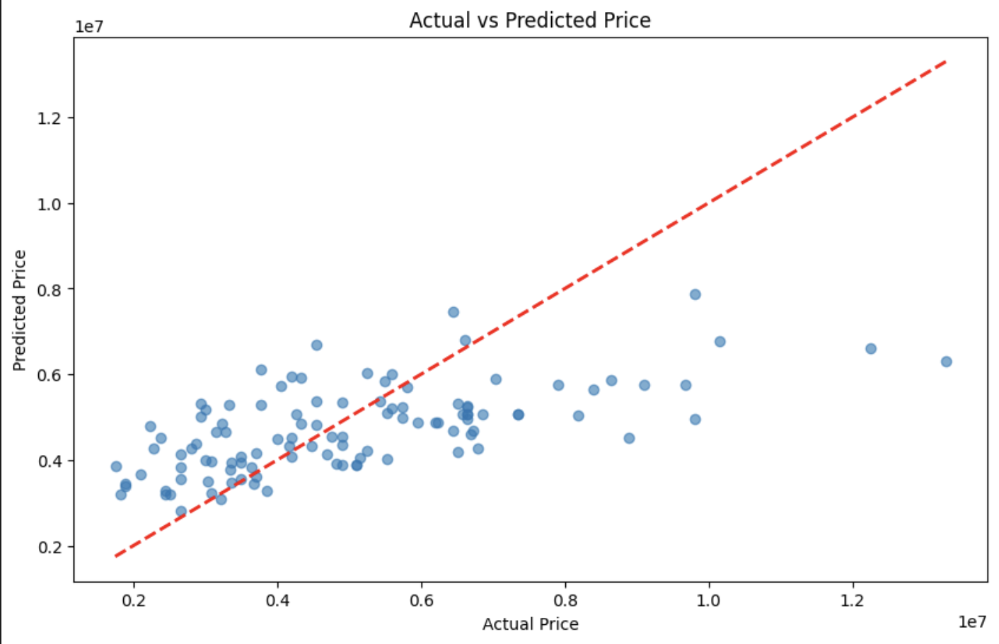

# AI & ML Internship - Task 3: Linear Regression

Understanding and implementing **Simple** and **Multiple Linear Regression** using `Scikit-learn`, `Pandas`, and `Matplotlib`.

## Steps

### 1. Dataset Loading and Preview
- Imported the dataset using `pandas`
- Inspected the first few rows to understand the structure

 **Dataset Preview**:  

### 2. Data Preprocessing
- Selected important features: **Area** and **Bedrooms**
- Checked for and handled any missing values
- Split data into **training** and **testing** sets

### 3. Model Training
- Built a **Linear Regression** model using `sklearn.linear_model.LinearRegression`
- Trained the model on the training dataset

 **Model Trained Successfully**:  

### 4. Model Evaluation
- Predicted values on the test set
- Evaluated the model using:
  - **Mean Absolute Error (MAE)**
  - **Mean Squared Error (MSE)**
  - **R-squared Score (R²)**

 **Model Evaluation Metrics**:  

### 5. Visualizations
- **Area vs Price** scatter plot
- **Bedrooms vs Price** scatter plot

 **Area vs Price**:  

 **Bedrooms vs Price**:  

### 6. Predicted vs Actual Plot
- Compared predicted house prices to the actual prices to visually assess model performance

 **Actual vs Predicted Prices**:  

##  Conclusion
- Successfully implemented multiple linear regression.
- Understood how different features (Area, Bedrooms) impact price predictions.
- Evaluated and visualized the model results for deeper insights.

 Tools Used : Python, Pandas, Matplotlib, Scikit-learn

